# Лабораторная работа №6 — Использование шаблонов проектирования (GoF)  
**Проект:** Rule-Based Compliance Assessment System (оценка ветки + материнской компании)

---

## Оглавление
- [Порождающие шаблоны](#порождающие-шаблоны)
  - [Фабричный метод](#фабричный-метод--factory-method)
  - [Абстрактная фабрика](#абстрактная-фабрика--abstract-factory)
  - [Строитель](#строитель--builder)
- [Структурные шаблоны](#структурные-шаблоны)
  - [Адаптер](#адаптер--adapter)
  - [Фасад](#фасад--facade)
  - [Декоратор](#декоратор--decorator)
  - [Компоновщик](#компоновщик--composite)
- [Поведенческие шаблоны](#поведенческие-шаблоны)
  - [Стратегия](#стратегия--strategy)
  - [Цепочка обязанностей](#цепочка-обязанностей--chain-of-responsibility)
  - [Наблюдатель](#наблюдатель--observer)
  - [Команда](#команда--command)
  - [Шаблонный метод](#шаблонный-метод--template-method)

---

# Порождающие шаблоны

## Фабричный метод / Factory Method

**Назначение (общее):**  
Определяет интерфейс для создания объекта, оставляя выбор конкретного класса подклассам/фабрике.

**Назначение в проекте:**  
Создание объектов правил проверки по `ruleType` (санкции, бенефициары, страна риска и т.д.) — без `new` по всему коду и без жёсткой связки с конкретными классами.

**UML:**  
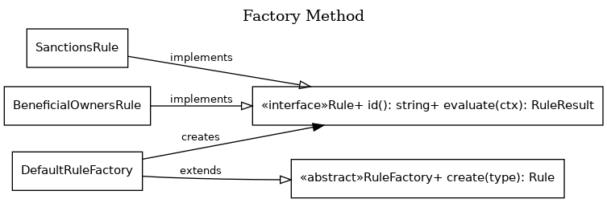

**Код (TypeScript, фрагмент):**
```ts
// domain/types.ts
export type RuleStatus = "PASS" | "FAIL" | "UNKNOWN";

export type RuleResult = {
  ruleId: string;
  status: RuleStatus;
  reason: string;
  evidence?: Record<string, any>;
};

export interface Rule {
  id(): string;
  evaluate(ctx: AssessmentContext): RuleResult;
}

export type Company = {
  id: string;
  name: string;
  country?: string;
  parentId?: string;
};

export type AssessmentContext = {
  branch: Company;
  parent?: Company;
  sanctionsHits?: Array<any>;
  beneficialOwners?: Array<any>;
  missing: string[];
};

// rules/sanctions.rule.ts
export class SanctionsRule implements Rule {
  id() { return "SANCTIONS"; }

  evaluate(ctx: AssessmentContext): RuleResult {
    const hits = ctx.sanctionsHits ?? [];
    if (!ctx.branch?.name) {
      ctx.missing.push("branch.name");
      return {
        ruleId: this.id(),
        status: "UNKNOWN",
        reason: "Нет имени компании для поиска по санкциям",
      };
    }

    const isHit = hits.length > 0;
    return {
      ruleId: this.id(),
      status: isHit ? "FAIL" : "PASS",
      reason: isHit ? "Найдено совпадение в санкционных списках" : "Совпадений не найдено",
      evidence: { hitsCount: hits.length }
    };
  }
}

// rules/bo.rule.ts
export class BeneficialOwnersRule implements Rule {
  id() { return "BENEFICIAL_OWNERS"; }

  evaluate(ctx: AssessmentContext): RuleResult {
    if (!ctx.beneficialOwners) {
      ctx.missing.push("beneficialOwners");
      return {
        ruleId: this.id(),
        status: "UNKNOWN",
        reason: "Нет данных по бенефициарам",
      };
    }
    const suspicious = ctx.beneficialOwners.some(o => o.share > 0.25 && o.isPEP === true);
    return {
      ruleId: this.id(),
      status: suspicious ? "FAIL" : "PASS",
      reason: suspicious ? "PEP с долей > 25%" : "Риск по бенефициарам не выявлен",
    };
  }
}

// rules/factory.ts
import { SanctionsRule } from "./sanctions.rule";
import { BeneficialOwnersRule } from "./bo.rule";

export abstract class RuleFactory {
  abstract create(ruleType: string): Rule;
}

export class DefaultRuleFactory extends RuleFactory {
  create(ruleType: string): Rule {
    switch (ruleType) {
      case "SANCTIONS": return new SanctionsRule();
      case "BENEFICIAL_OWNERS": return new BeneficialOwnersRule();
      default:
        throw new Error(`Неизвестный ruleType: ${ruleType}`);
    }
  }
}

// usage/example.ts
const factory = new DefaultRuleFactory();
const rule = factory.create("SANCTIONS");
const ctx: AssessmentContext = {
  branch: { id: "B1", name: "ACME BV" },
  missing: [],
  sanctionsHits: [],
};
console.log(rule.evaluate(ctx));
```

---

## Абстрактная фабрика / Abstract Factory

**Назначение (общее):**  
Предоставляет интерфейс для создания семейств связанных объектов, не указывая их конкретные классы.

**Назначение в проекте:**  
Переключение набора источников данных (боевой контур / мок-контур): `ProdFactory` создаёт API-клиенты, `MockFactory` — заглушки для тестирования сценариев.

**UML:**  
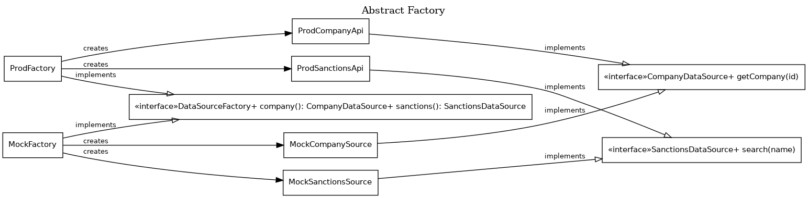

**Код (TypeScript, фрагмент):**
```ts
// datasources/contracts.ts
export interface CompanyDataSource {
  getCompany(id: string): Promise<Company>;
}

export interface SanctionsDataSource {
  search(name: string): Promise<any[]>;
}

export interface DataSourceFactory {
  company(): CompanyDataSource;
  sanctions(): SanctionsDataSource;
}

// datasources/prod.ts
export class ProdCompanyApi implements CompanyDataSource {
  async getCompany(id: string): Promise<Company> {
    // здесь мог бы быть HTTP вызов
    return { id, name: "Real Company", country: "NL", parentId: "P1" };
  }
}

export class ProdSanctionsApi implements SanctionsDataSource {
  async search(name: string): Promise<any[]> {
    // здесь мог бы быть поиск по внешнему провайдеру
    return [];
  }
}

export class ProdFactory implements DataSourceFactory {
  company() { return new ProdCompanyApi(); }
  sanctions() { return new ProdSanctionsApi(); }
}

// datasources/mock.ts
export class MockCompanySource implements CompanyDataSource {
  async getCompany(id: string): Promise<Company> {
    return { id, name: "Mock Company", country: "RU", parentId: "P1" };
  }
}

export class MockSanctionsSource implements SanctionsDataSource {
  async search(name: string): Promise<any[]> {
    return [{ list: "MOCK_LIST", name, score: 0.93 }];
  }
}

export class MockFactory implements DataSourceFactory {
  company() { return new MockCompanySource(); }
  sanctions() { return new MockSanctionsSource(); }
}

// usage/example.ts
const sources: DataSourceFactory = new MockFactory();
const company = await sources.company().getCompany("B1");
const hits = await sources.sanctions().search(company.name);
console.log(company, hits);
```

---

## Строитель / Builder

**Назначение (общее):**  
Позволяет поэтапно создавать сложный объект, отделяя процесс сборки от представления.

**Назначение в проекте:**  
Сборка explainable-отчёта `AssessmentReport` (итог, причины, результаты правил, missing data) из результатов branch + parent и логики объединения.

**UML:**  
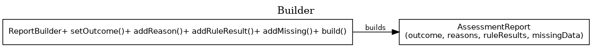

**Код (TypeScript, фрагмент):**
```ts
export type Outcome = "APPROVE" | "REJECT" | "REVIEW";

export type AssessmentReport = {
  entityId: string;
  outcome: Outcome;
  reasons: string[];
  ruleResults: RuleResult[];
  missingData: string[];
  generatedAt: string;
};

export class ReportBuilder {
  private report: AssessmentReport;

  constructor(entityId: string) {
    this.report = {
      entityId,
      outcome: "REVIEW",
      reasons: [],
      ruleResults: [],
      missingData: [],
      generatedAt: new Date().toISOString()
    };
  }

  setOutcome(o: Outcome) { this.report.outcome = o; return this; }
  addReason(r: string) { this.report.reasons.push(r); return this; }
  addRuleResult(rr: RuleResult) { this.report.ruleResults.push(rr); return this; }
  addMissing(field: string) {
    if (!this.report.missingData.includes(field)) this.report.missingData.push(field);
    return this;
  }

  build(): AssessmentReport {
    // небольшая нормализация/сортировка для читаемости отчёта
    this.report.missingData.sort();
    return this.report;
  }
}

// usage/example.ts
const b = new ReportBuilder("B1")
  .setOutcome("REJECT")
  .addReason("SANCTIONS: найдено совпадение")
  .addMissing("beneficialOwners");

const report = b.build();
console.log(report);
```

---

# Структурные шаблоны

## Адаптер / Adapter

**Назначение (общее):**  
Преобразует интерфейс одного класса в интерфейс, который ожидают клиенты.

**Назначение в проекте:**  
Разные провайдеры санкций/реестров дают разные форматы — адаптер нормализует их к общему `NormalizedSanctionsHit`.

**UML:**  
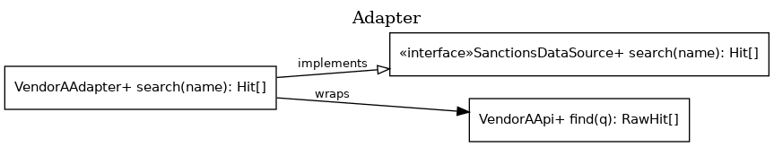

**Код (TypeScript, фрагмент):**
```ts
export type NormalizedSanctionsHit = {
  name: string;
  source: string;
  risk: "HIGH" | "MEDIUM" | "LOW";
  raw: any;
};

export class VendorAApi {
  find(q: string) {
    return [{ full_name: q, list_name: "A_LIST", score: 0.95 }];
  }
}

export interface SanctionsDataSource {
  search(name: string): Promise<NormalizedSanctionsHit[]>;
}

export class VendorAAdapter implements SanctionsDataSource {
  constructor(private api: VendorAApi) {}

  async search(name: string): Promise<NormalizedSanctionsHit[]> {
    const raw = this.api.find(name);
    return raw.map(r => {
      const risk = r.score >= 0.9 ? "HIGH" : r.score >= 0.7 ? "MEDIUM" : "LOW";
      return {
        name: r.full_name,
        source: r.list_name,
        risk,
        raw: r
      };
    });
  }
}

// usage/example.ts
const src: SanctionsDataSource = new VendorAAdapter(new VendorAApi());
console.log(await src.search("ACME BV"));
```

---

## Фасад / Facade

**Назначение (общее):**  
Предоставляет простой интерфейс к сложной подсистеме.

**Назначение в проекте:**  
`ComplianceFacade` скрывает шаги: получение данных ветки/материнской → запуск правил → merge → сбор отчёта.

**UML:**  
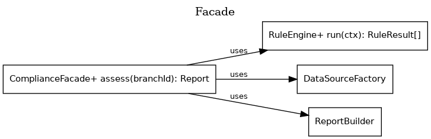

**Код (TypeScript, фрагмент):**
```ts
export class RuleEngine {
  constructor(private rules: Rule[]) {}
  run(ctx: AssessmentContext): RuleResult[] {
    return this.rules.map(r => r.evaluate(ctx));
  }
}

export class ComplianceFacade {
  constructor(
    private sources: DataSourceFactory,
    private engine: RuleEngine,
    private merger: MergeStrategy
  ) {}

  async assess(branchId: string): Promise<AssessmentReport> {
    const missing: string[] = [];

    // 1) Load branch
    const branch = await this.sources.company().getCompany(branchId);

    // 2) Load parent (если есть)
    const parent = branch.parentId ? await this.sources.company().getCompany(branch.parentId) : undefined;

    // 3) Load sanctions for branch & parent
    const branchHits = await this.sources.sanctions().search(branch.name);
    const parentHits = parent ? await this.sources.sanctions().search(parent.name) : [];

    // 4) Run rules separately
    const branchCtx: AssessmentContext = { branch, parent, sanctionsHits: branchHits, missing };
    const parentCtx: AssessmentContext = { branch: parent ?? branch, parent: undefined, sanctionsHits: parentHits, missing };

    const branchResults = this.engine.run(branchCtx);
    const parentResults = parent ? this.engine.run(parentCtx) : [];

    // 5) Merge
    const outcome = this.merger.merge(branchResults, parentResults);

    // 6) Build report
    const builder = new ReportBuilder(branchId).setOutcome(outcome);
    [...branchResults, ...parentResults].forEach(r => {
      builder.addRuleResult(r).addReason(`${r.ruleId}: ${r.reason}`);
    });
    missing.forEach(m => builder.addMissing(m));
    if (!parent) builder.addReason("Parent: отсутствует связь или данные");

    return builder.build();
  }
}
```

---

## Декоратор / Decorator

**Назначение (общее):**  
Динамически добавляет объекту новое поведение без изменения исходного класса.

**Назначение в проекте:**  
Добавление кэширования/логирования вокруг `SanctionsDataSource` (аудит вызовов, оптимизация количества запросов).

**UML:**  
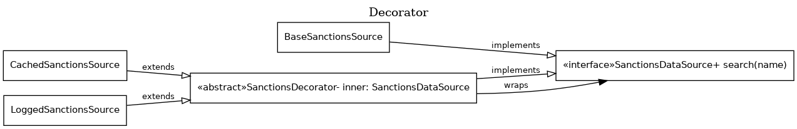

**Код (TypeScript, фрагмент):**
```ts
export class BaseSanctionsSource implements SanctionsDataSource {
  async search(name: string): Promise<NormalizedSanctionsHit[]> {
    return []; // реализация по умолчанию
  }
}

abstract class SanctionsDecorator implements SanctionsDataSource {
  constructor(protected inner: SanctionsDataSource) {}
  abstract search(name: string): Promise<NormalizedSanctionsHit[]>;
}

export class CachedSanctionsSource extends SanctionsDecorator {
  private cache = new Map<string, NormalizedSanctionsHit[]>();

  async search(name: string) {
    if (this.cache.has(name)) return this.cache.get(name)!;
    const res = await this.inner.search(name);
    this.cache.set(name, res);
    return res;
  }
}

export class LoggedSanctionsSource extends SanctionsDecorator {
  async search(name: string) {
    const started = Date.now();
    const res = await this.inner.search(name);
    console.log(`[AUDIT] sanctions.search name=${name} hits=${res.length} ms=${Date.now()-started}`);
    return res;
  }
}

// usage/example.ts
const src = new LoggedSanctionsSource(new CachedSanctionsSource(new VendorAAdapter(new VendorAApi())));
console.log(await src.search("ACME BV"));
```

---

## Компоновщик / Composite

**Назначение (общее):**  
Позволяет обрабатывать одиночные и составные объекты одинаково.

**Назначение в проекте:**  
Группа обязательных проверок (mandatory checks) оформляется как `RuleGroup`, выдающая агрегированный результат по дочерним правилам.

**UML:**  
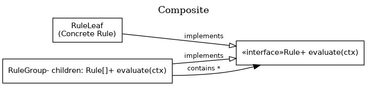

**Код (TypeScript, фрагмент):**
```ts
export class RuleGroup implements Rule {
  constructor(private groupId: string, private children: Rule[]) {}
  id() { return this.groupId; }

  evaluate(ctx: AssessmentContext): RuleResult {
    const results = this.children.map(r => r.evaluate(ctx));
    const hasFail = results.some(r => r.status === "FAIL");
    const hasUnknown = results.some(r => r.status === "UNKNOWN");

    return {
      ruleId: this.id(),
      status: hasFail ? "FAIL" : hasUnknown ? "UNKNOWN" : "PASS",
      reason: `Группа ${this.groupId}: aggregated`,
      evidence: {
        children: results.map(r => ({ ruleId: r.ruleId, status: r.status }))
      }
    };
  }
}

// usage/example.ts
const group = new RuleGroup("MANDATORY", [new SanctionsRule(), new BeneficialOwnersRule()]);
console.log(group.evaluate({ branch: { id:"B1", name:"ACME" }, missing: [], sanctionsHits: [], beneficialOwners: [] }));
```

---

# Поведенческие шаблоны

## Стратегия / Strategy

**Назначение (общее):**  
Определяет семейство алгоритмов и делает их взаимозаменяемыми.

**Назначение в проекте:**  
Разные политики объединения результатов ветки и материнской компании (консервативная, взвешенная, “review при missing”).

**UML:**  
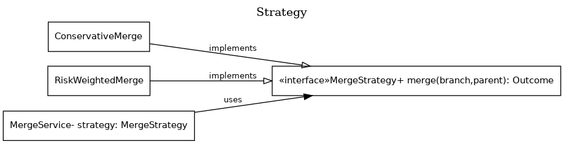

**Код (TypeScript, фрагмент):**
```ts
export type Outcome = "APPROVE" | "REJECT" | "REVIEW";

export interface MergeStrategy {
  merge(branch: RuleResult[], parent: RuleResult[]): Outcome;
}

export class ConservativeMerge implements MergeStrategy {
  merge(branch: RuleResult[], parent: RuleResult[]): Outcome {
    const all = [...branch, ...parent];
    if (all.some(r => r.status === "FAIL")) return "REJECT";
    if (all.some(r => r.status === "UNKNOWN")) return "REVIEW";
    return "APPROVE";
  }
}

export class RiskWeightedMerge implements MergeStrategy {
  private weight(r: RuleResult): number {
    if (r.status === "FAIL") return 10;
    if (r.status === "UNKNOWN") return 3;
    return 0;
  }

  merge(branch: RuleResult[], parent: RuleResult[]): Outcome {
    const score = [...branch, ...parent].reduce((s, r) => s + this.weight(r), 0);
    if (score >= 10) return "REJECT";
    if (score >= 3) return "REVIEW";
    return "APPROVE";
  }
}
```

---

## Цепочка обязанностей / Chain of Responsibility

**Назначение (общее):**  
Передаёт запрос по цепочке обработчиков, пока один из них не обработает (или пока не закончится цепь).

**Назначение в проекте:**  
Реализация workflow обязательных проверок: наличие данных → санкции → ownership → linkage → формирование промежуточных результатов.

**UML:**  
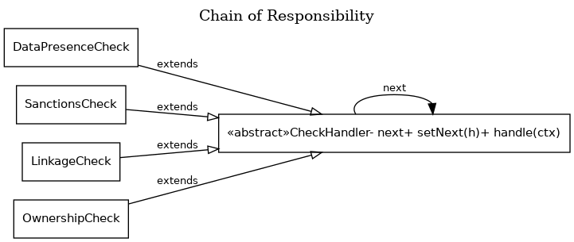

**Код (TypeScript, фрагмент):**
```ts
export type WorkflowCtx = {
  ctx: AssessmentContext;
  results: RuleResult[];
};

export abstract class CheckHandler {
  protected next?: CheckHandler;

  setNext(h: CheckHandler) { this.next = h; return h; }
  handle(w: WorkflowCtx) {
    this.process(w);
    this.next?.handle(w);
  }
  protected abstract process(w: WorkflowCtx): void;
}

export class DataPresenceCheck extends CheckHandler {
  protected process(w: WorkflowCtx) {
    if (!w.ctx.branch.name) w.ctx.missing.push("branch.name");
    if (w.ctx.branch.parentId && !w.ctx.parent) w.ctx.missing.push("parent.linkedCompany");
  }
}

export class SanctionsCheck extends CheckHandler {
  protected process(w: WorkflowCtx) {
    const hits = w.ctx.sanctionsHits ?? [];
    w.results.push({
      ruleId: "SANCTIONS",
      status: hits.length > 0 ? "FAIL" : "PASS",
      reason: hits.length > 0 ? "Есть санкционные совпадения" : "Санкционных совпадений нет",
      evidence: { hitsCount: hits.length }
    });
  }
}

export class LinkageCheck extends CheckHandler {
  protected process(w: WorkflowCtx) {
    const linked = Boolean(w.ctx.branch.parentId);
    w.results.push({
      ruleId: "LINKAGE",
      status: linked ? "PASS" : "UNKNOWN",
      reason: linked ? "Есть parentId для связи" : "Нет parentId, связь branch-parent не установлена",
    });
  }
}

// usage/example.ts
const chain = new DataPresenceCheck();
chain.setNext(new LinkageCheck()).setNext(new SanctionsCheck());

const w: WorkflowCtx = {
  ctx: { branch: { id:"B1", name:"ACME", parentId:"P1" }, parent: undefined, missing: [], sanctionsHits: [] },
  results: []
};
chain.handle(w);
console.log(w.results, w.ctx.missing);
```

---

## Наблюдатель / Observer

**Назначение (общее):**  
Определяет зависимость “один ко многим”: при событии издателя все подписчики получают уведомление.

**Назначение в проекте:**  
Аудит и метрики выполнения проверок: запуск правила, результат, missing data, тайминги.

**UML:**  
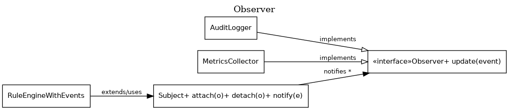

**Код (TypeScript, фрагмент):**
```ts
export type Event = {
  type: "RULE_STARTED" | "RULE_FINISHED" | "DATA_MISSING";
  payload: any;
  at: string;
};

export interface Observer {
  update(e: Event): void;
}

export class Subject {
  private observers: Observer[] = [];
  attach(o: Observer) { this.observers.push(o); }
  detach(o: Observer) { this.observers = this.observers.filter(x => x !== o); }
  notify(e: Event) { this.observers.forEach(o => o.update(e)); }
}

export class AuditLogger implements Observer {
  update(e: Event) {
    console.log(`[AUDIT] ${e.type}`, e.payload);
  }
}

export class MetricsCollector implements Observer {
  private counters: Record<string, number> = {};
  update(e: Event) {
    this.counters[e.type] = (this.counters[e.type] ?? 0) + 1;
  }
  snapshot() { return { ...this.counters }; }
}

export class RuleEngineWithEvents extends Subject {
  constructor(private rules: Rule[]) { super(); }

  run(ctx: AssessmentContext): RuleResult[] {
    return this.rules.map(rule => {
      this.notify({ type:"RULE_STARTED", payload: { ruleId: rule.id() }, at: new Date().toISOString() });
      const res = rule.evaluate(ctx);
      this.notify({ type:"RULE_FINISHED", payload: res, at: new Date().toISOString() });
      return res;
    });
  }
}

// usage/example.ts
const engine = new RuleEngineWithEvents([new SanctionsRule()]);
const audit = new AuditLogger();
const metrics = new MetricsCollector();
engine.attach(audit);
engine.attach(metrics);

engine.run({ branch: { id:"B1", name:"ACME" }, missing: [], sanctionsHits: [] });
console.log(metrics.snapshot());
```

---

## Команда / Command

**Назначение (общее):**  
Инкапсулирует запрос как объект, позволяя ставить команды в очередь, логировать, переиспользовать.

**Назначение в проекте:**  
Каждое вычисление правила оформляется как `EvaluateRuleCommand`, а `CommandRunner` запускает набор команд (например, выбранные mandatory checks) и возвращает результаты.

**UML:**  
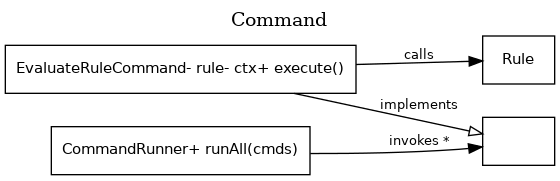

**Код (TypeScript, фрагмент):**
```ts
export interface Command<T> {
  execute(): T;
}

export class EvaluateRuleCommand implements Command<RuleResult> {
  constructor(private rule: Rule, private ctx: AssessmentContext) {}
  execute(): RuleResult {
    return this.rule.evaluate(this.ctx);
  }
}

export class CommandRunner {
  runAll(cmds: Array<Command<RuleResult>>): RuleResult[] {
    const out: RuleResult[] = [];
    for (const c of cmds) out.push(c.execute());
    return out;
  }
}

// usage/example.ts
const ctx: AssessmentContext = { branch: { id:"B1", name:"ACME" }, missing: [], sanctionsHits: [] };
const cmds = [new EvaluateRuleCommand(new SanctionsRule(), ctx), new EvaluateRuleCommand(new BeneficialOwnersRule(), ctx)];
const runner = new CommandRunner();
console.log(runner.runAll(cmds));
```

---

## Шаблонный метод / Template Method

**Назначение (общее):**  
Определяет “скелет” алгоритма в базовом классе, позволяя подклассам переопределять отдельные шаги без изменения структуры алгоритма.

**Назначение в проекте:**  
Общий pipeline оценки: загрузка данных → запуск правил → merge → отчёт. Конкретная реализация для `branch+parent` задаёт, как именно загружать данные и какие правила запускать.

**UML:**  
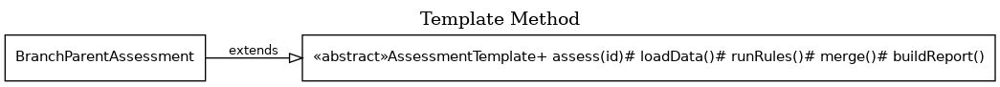

**Код (TypeScript, фрагмент):**
```ts
export abstract class AssessmentTemplate {
  async assess(entityId: string): Promise<AssessmentReport> {
    const ctx = await this.loadData(entityId);
    const results = this.runRules(ctx);
    const outcome = this.merge(results);
    return this.buildReport(entityId, outcome, results, ctx);
  }

  protected abstract loadData(entityId: string): Promise<AssessmentContext>;
  protected abstract runRules(ctx: AssessmentContext): RuleResult[];
  protected abstract merge(results: RuleResult[]): Outcome;

  protected buildReport(entityId: string, outcome: Outcome, results: RuleResult[], ctx: AssessmentContext): AssessmentReport {
    const b = new ReportBuilder(entityId).setOutcome(outcome);
    results.forEach(r => b.addRuleResult(r).addReason(`${r.ruleId}: ${r.reason}`));
    ctx.missing.forEach(m => b.addMissing(m));
    return b.build();
  }
}

export class BranchParentAssessment extends AssessmentTemplate {
  constructor(private sources: DataSourceFactory, private engine: RuleEngine, private merger: MergeStrategy) { super(); }

  protected async loadData(branchId: string): Promise<AssessmentContext> {
    const missing: string[] = [];
    const branch = await this.sources.company().getCompany(branchId);
    const parent = branch.parentId ? await this.sources.company().getCompany(branch.parentId) : undefined;
    const sanctionsHits = await this.sources.sanctions().search(branch.name);
    return { branch, parent, sanctionsHits, missing };
  }

  protected runRules(ctx: AssessmentContext): RuleResult[] {
    return this.engine.run(ctx);
  }

  protected merge(results: RuleResult[]): Outcome {
    // пример: merge только по текущим results (для простоты).
    // в реальном случае сюда добавляются результаты parent-оценки.
    return this.merger.merge(results, []);
  }
}
```

---

# Заключение

В лабораторной работе применены шаблоны GoF:  
- **Порождающие:** Factory Method, Abstract Factory, Builder  
- **Структурные:** Adapter, Facade, Decorator, Composite  
- **Поведенческие:** Strategy, Chain of Responsibility, Observer, Command, Template Method  

Шаблоны обеспечили расширяемость набора правил, заменяемость источников данных, прозрачный workflow обязательных проверок и объяснимость итогового решения.